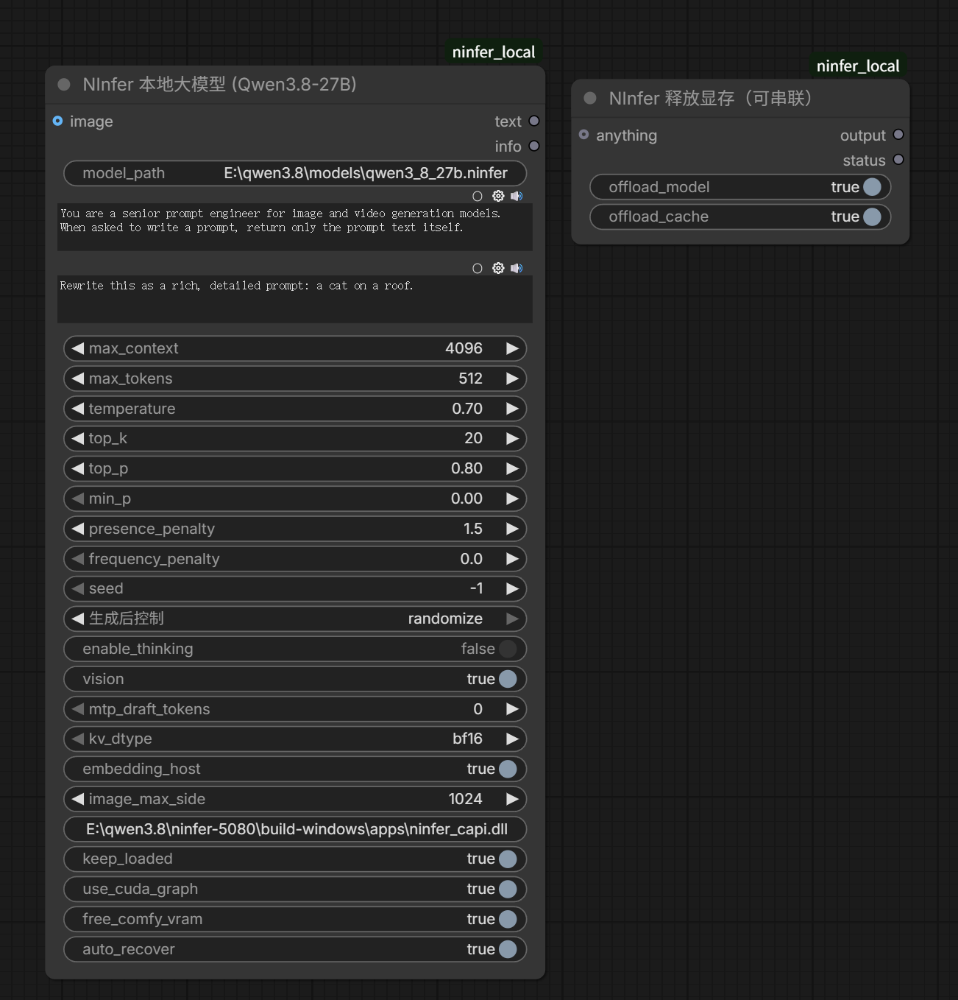

# ComfyUI-NInfer

English | **[简体中文](README.zh-CN.md)**

Run [NInfer](https://github.com/Neroued/ninfer) LLMs inside ComfyUI's own process. No server, no
subprocess, no Ollama — the engine is a native library loaded straight into ComfyUI via ctypes.
It loads once and stays resident, so every call after the first costs 0 s.



## Requirements

| | |
|---|---|
| OS | Windows x64 |
| GPU | NVIDIA **RTX 50-series** (`sm_120`) for the prebuilt engine |
| VRAM | **16 GB minimum** for a ~15 GiB artifact; the official artifacts want 24 GB+ |
| ComfyUI | any recent version (developed on 0.36) |
| Python packages | **none** — numpy and Pillow already ship with ComfyUI |
| Disk | ~250 MB for the engine + 16–23 GB for a model artifact |

The engine binary has to match your GPU's compute capability. The published build contains
`sm_120a` code only, so it runs exclusively on RTX 50-series:

| GPU | Compute | Prebuilt engine | Other GPUs |
|---|---|---|---|
| RTX 5090 / 5080 / 5070 Ti / 5070 | `sm_120` | ✅ yes | — |
| RTX 4000-series, L4, L40S | `sm_89` | ❌ | [build it](docs/COMPATIBILITY.md#other-gpus) |
| RTX 3000-series, A40, A6000 | `sm_86` | ❌ | [build it](docs/COMPATIBILITY.md#other-gpus) |
| A100 / H100 | `sm_80` / `sm_90` | ❌ | [build it](docs/COMPATIBILITY.md#other-gpus) |
| AMD, Intel, Apple | — | ❌ | not supported (CUDA only) |

On an unsupported card you get `CUDA error: no kernel image is available for execution on the
device`, and the node tells you the exact build command for your GPU.
Details, tested/untested status and per-architecture base repos: [docs/COMPATIBILITY.md](docs/COMPATIBILITY.md).

## Installation

```bash
cd <ComfyUI>/custom_nodes
git clone https://github.com/YukinoKaorisuna/ComfyUI-NInfer
cd ComfyUI-NInfer
python tools/fetch_engine.py
```

For a standalone (portable) ComfyUI release:

```bat
cd ComfyUI_windows_portable
git clone https://github.com/YukinoKaorisuna/ComfyUI-NInfer ComfyUI\custom_nodes\ComfyUI-NInfer
python_embeded\python.exe ComfyUI\custom_nodes\ComfyUI-NInfer\tools\fetch_engine.py
```

`fetch_engine.py` detects your GPU, downloads the matching engine (~250 MB) into `bin/`, and
**skips itself when an engine is already installed** (`--force` re-downloads). Restart ComfyUI
afterwards. To check everything before running:

```
python tools/doctor.py
```

Manual download instead: take the archive matching your GPU (e.g. `ninfer-engine-win-x64-sm120a-<version>.zip`)
from the [Releases page](https://github.com/YukinoKaorisuna/ComfyUI-NInfer/releases) and unzip
everything into `ComfyUI-NInfer/bin/`.

```
ComfyUI-NInfer/
├── bin/          engine + its runtime DLLs land here (git-ignored)
└── tools/        fetch_engine.py, doctor.py, build_engine.ps1
```

## Models

`.ninfer` artifacts only. **GGUF and safetensors are not supported** — they belong to a
different engine.

> [!IMPORTANT]
> Two artifacts from different generations share the filename `qwen3_8_27b.ninfer`, and they are
> **not the same file** (15.33 GiB vs 19.03 GiB). Take the one matching your VRAM; keep them in
> separate folders if you want both.

### 16 GB cards (what this README targets)

| File | Size | Repository |
|---|---|---|
| `qwen3_8_27b.ninfer` | **15.33 GiB** | [ninfer-5080/Qwen3.8-27B-RTX5080](https://huggingface.co/ninfer-5080/Qwen3.8-27B-RTX5080) |

Every VRAM and speed figure in this README was measured on this file, and the prebuilt engine is
validated against it. It is a **release profile built for 16 GB**: mixed Q3/Q4/Q5 weights
(~3.95 effective BPW), validated for 128K context, Q4 KV, MTP-3 and vision.

Verify the download:

```
sha256sum qwen3_8_27b.ninfer
# must print
c4a7e9ab593a7f42d58208fa0065d67a82d61921107686cc9f6ed1ec6b050e21
```

### 24 GB and up

Larger, higher-precision artifacts published by NInfer's author
([Neroued](https://huggingface.co/neroued)), Apache-2.0, all including vision and MTP:

| File | Size | Repository |
|---|---|---|
| `qwen3_6_27b.ninfer` | 16.29 GiB | [neroued/Qwen3.6-27B-NInfer](https://huggingface.co/neroued/Qwen3.6-27B-NInfer) |
| `qwen3_8_27b.ninfer` | 19.03 GiB | [neroued/Qwen3.8-27B-NInfer](https://huggingface.co/neroued/Qwen3.8-27B-NInfer) |
| `qwen3_6_35b_a3b.ninfer` | 21.23 GiB | [neroued/Qwen3.6-35B-A3B-NInfer](https://huggingface.co/neroued/Qwen3.6-35B-A3B-NInfer) |
| `qwen3_8_27b_nvfp4.ninfer` | 22.09 GiB | ⚠️ NVFP4 does not work on Windows |
| `qwen3_6_27b_nvfp4.ninfer` | 17.07 GiB | ⚠️ same |

### Community artifacts

| File | Repository | Note |
|---|---|---|
| `ornith_1_5_35b_a3b.ninfer` | [huggingJDE/Ornith-1.5-35B-A3B-NInfer](https://huggingface.co/huggingJDE/Ornith-1.5-35B-A3B-NInfer) | the only artifact validated for RTX 3090 / 3080 |
| `qwen3_8_27b_uncensored.ninfer` | [YukinoKaorisuna/Qwen3.8-27B-Uncensored-ninfer](https://huggingface.co/YukinoKaorisuna/Qwen3.8-27B-Uncensored-ninfer) | abliterated |

Put the file in **`ComfyUI/models/LLM/`** and restart ComfyUI — it appears in the node's `model`
dropdown. To add extra folders:

```bat
set NINFER_MODEL_DIRS=D:\models
```

Full catalogue, mirrors and container-version notes: [docs/MODELS.md](docs/MODELS.md).

## Nodes

### NInfer Local LLM (.ninfer / Qwen3.8)

`image` is optional: connect one for image-to-prompt, leave it empty for text. Both use the same
node.

| Widget | Default | Description |
|---|---|---|
| `model` | first found | `.ninfer` files scanned from `ComfyUI/models/LLM` |
| `system_prompt` | prompt-engineer role | keep it identical between runs to help prefix reuse |
| `user_prompt` | | your input |
| `max_context` | 4096 | the main VRAM lever; 4096 is the safe ceiling on 16 GB |
| `max_tokens` | 512 | |
| `temperature` `top_k` `top_p` `min_p` `presence_penalty` `frequency_penalty` `seed` | 0.7 / 20 / 0.8 / 0 / 1.5 / 0 / −1 | sampling |
| `enable_thinking` | **false** | leave off — it is a 5–10× difference on prompt work |
| `vision` | true | required when an image is connected; costs ~2 GiB |
| `mtp_draft_tokens` | 0 | set 3 to enable MTP speculative decoding |
| `kv_dtype` | bf16 | drop to `int8` when VRAM is tight |
| `embedding_host` | true | keeps ~0.8 GiB of embedding table in host RAM — leave on |
| `image_max_side` | 1024 | connected images are downscaled to this |
| `keep_loaded` | true | off releases the engine after every run |
| `use_cuda_graph` | true | fastest; unchecking it unlocks a larger `max_context` |
| `free_comfy_vram` | true | unloads ComfyUI's own models just before the engine is created |
| `auto_recover` | true | retries a failed engine creation instead of failing (see Troubleshooting) |
| `model_path_override`, `dll_path` | empty | for files outside the scanned folders |

Outputs `text` and `info`. `info` reports timings and the engine's VRAM footprint — wire it into
a Show Text node the first time you run this.

`max_context`, `vision`, `kv_dtype`, `embedding_host`, `mtp_draft_tokens` and `use_cuda_graph` are
fixed when the engine is created; changing one triggers a reload (a few seconds).

### NInfer Free VRAM (pass-through)

Insert it anywhere on a link — `anything` accepts any type and `output` passes the same value
through, so it can sit between a sampler and anything else. With nothing connected it works as a
standalone cleanup node.

| Widget | Description |
|---|---|
| `offload_model` | unload ComfyUI's models |
| `offload_cache` | empty the torch cache |

It also releases the engine's ~14 GiB. No other node can do that: the engine's memory is native
`cudaMalloc` inside the DLL, so a generic "clean VRAM" node cannot see it.

## Recommended settings

| Goal | Settings |
|---|---|
| Expand / translate prompts | `max_context 4096`, `embedding_host ✓`, `enable_thinking ✗`, `vision ✗` if you never attach an image |
| Image-to-prompt | as above plus `vision ✓` and connect `image` |
| Larger context | `use_cuda_graph ✗`, then `max_context 8192` (costs ~half the decode speed) |
| Free the card after each run | `keep_loaded ✗`, or `NInfer Free VRAM` downstream |

## VRAM

A 27B artifact is a near-capacity fit on a 16 GB card. ComfyUI itself occupies ~1.3 GiB before
you generate anything, so the fit is decided by a few hundred MiB. Measured on an RTX 5070 Ti
(15.92 GiB) with ComfyUI running and a 15.33 GiB artifact:

| `max_context` | `embedding_host` | `use_cuda_graph` | Result |
|---|---|---|---|
| 8192 | on | on | ❌ fail — 0.09 GiB short |
| 8192 | on | **off** | ✅ works, slow (62 chars/s) |
| 6144 | on | on | ⚠️ flaky — CUDA-graph budget trips intermittently |
| 6144 | on | off | ✅ works |
| **4096** | **on** | **on** | ✅ **recommended** — fastest (128 chars/s) |

- If you only have 16 GB, **turn `embedding_host` on** (~0.8 GiB for free) and keep `max_context` at 4096.
- A `CUDA Graph preparation consumed …` error means set `use_cuda_graph ✗`, not "free more memory".
- The engine and a diffusion model cannot coexist at these sizes. Time-slice with `NInfer Free VRAM`,
  or use a smaller artifact (~11 GiB) to leave room for diffusion.

## Troubleshooting

| Message | Meaning | Fix |
|---|---|---|
| `no kernel image is available for execution on the device` | the engine has no code for your GPU | [build for your architecture](docs/COMPATIBILITY.md#other-gpus) |
| `runtime reservation requires X, but only Y bytes are available` | `Y` is the live free VRAM after the weights loaded; `0` means the card is full | `free_comfy_vram ✓`, lower `max_context`, `kv_dtype int8`, `vision ✗` |
| `model weights require X … but only Y bytes are free` | the weights alone do not fit | free VRAM or use a smaller artifact |
| `CUDA Graph preparation consumed X, exceeding the planned allowance of Y` | the graph budget estimate is too small for this configuration | `use_cuda_graph ✗` (automatic with `auto_recover ✓`) |

**Engine not found** — run `python tools/fetch_engine.py`.
**Model not found** — the error lists every folder that was scanned.
**A model I just added is missing from the dropdown** — restart ComfyUI; the list is built at startup.
**Generation is slow** — check `enable_thinking` is off.
**ComfyUI ran out of VRAM after using the LLM** — the engine is still resident; add `NInfer Free VRAM`
before your sampler, or set `keep_loaded ✗`.
**Images are sent as JPEG** — the bundled FFmpeg has no PNG decoder.

`python tools/doctor.py` reports all of the above in one shot.

## Performance

RTX 5070 Ti, 16 GB, ComfyUI running, `max_context 4096`:

| | |
|---|---|
| Engine create (15.33 GB artifact) | 3.3 s warm, ~10 s cold |
| Engine reuse | **0.00 s** |
| Decode | ≈70 tok/s (0.68 s for 48 tokens) |
| After `NInfer Free VRAM` | VRAM fully returned |

The Python wrapper adds ~8 µs per execution — under 0.002 % of a generation — and the native path
is unchanged, so decode speed is identical to running the engine standalone.

### Measured against a llama.cpp node

Same machine, same 27B-class model, `max_context 4096`. Both engines warm — no cleanup node in
front of the LLM — with 200–250 characters of output:

| Task | This pack | `ComfyUI-LLM-text-processor` (llama.cpp, Qwen3.8-27B IQ4_XS, 14.63 GiB) |
|---|---|---|
| Translate a prompt (≈230 chars out) | **1.37 s** | 13.56 s |
| Expand a prompt (≈200 chars out) | **3.56 s** | 16.80 s |
| First run of a session (cold, 15 GB read) | 21.24 s | 32.55 s |

**4–10× faster** on repeat runs. Most of the gap is the 15 GB reload: the engine stays resident
here, while the llama.cpp path re-reads the model unless its own cache survives the run.

> [!WARNING]
> **Do not put a cleanup node in front of the LLM.** A workflow containing `NInfer Free VRAM`
> (or any VRAM-cleanup node) *before* the LLM node destroys the resident engine and forces a full
> 15 GB reload every single run — measured at **15–21 s instead of 1.4–3.6 s**. Put it **after**
> the LLM node, or leave it out and keep `keep_loaded` on.

### Versus the usual alternatives

| | This pack (in-process DLL) | Local HTTP server (Ollama, llama-server) | Spawn-per-run nodes |
|---|---|---|---|
| Call overhead | one ctypes function call | HTTP + JSON round-trip | process start |
| First engine start | 3–10 s | 3–10 s | **3–10 s every single run** |
| Every run after | **0 s** — the engine stays resident | 0 s, but ~15 GB is held by a second process you have to manage | 0 s |
| VRAM release | `NInfer Free VRAM` hands every byte back to diffusion | the server keeps holding it | only on process exit |
| Extra dependencies | none | one more service to install and run | usually pip packages |

## Documentation

- [docs/COMPATIBILITY.md](docs/COMPATIBILITY.md) — GPU / OS matrix, building for other architectures
- [docs/MODELS.md](docs/MODELS.md) — full artifact catalogue, mirrors, container versions
- [docs/TECHNICAL.md](docs/TECHNICAL.md) — how the in-process bridge is built

## Credits

- **[Neroued](https://github.com/Neroued)** — author of NInfer and publisher of the official
  artifacts. This pack is only a client of that work.
- **[toddballinger](https://github.com/toddballinger/ninfer-5080)** — the RTX 5080 optimisation
  line, and the publisher of the 15.33 GiB 16 GB artifact this pack is built around.
- **[YukinoKaorisuna/ninfer-5070ti](https://github.com/YukinoKaorisuna/ninfer-5070ti)** — the
  Windows/MSVC port the prebuilt engine is built from
  ([upstream PR](https://github.com/toddballinger/ninfer-5080/pull/16)).
- **Community engine builds** for other architectures: [Ambolio](https://github.com/Ambolio/ninfer-4090-windows),
  [UDPSendToFailed](https://github.com/UDPSendToFailed/ninfer-4090),
  [Don-Chad](https://github.com/Don-Chad/ninfer-3090),
  [natpate](https://github.com/natpate/ninfer-windows).
- **[Qwen](https://github.com/QwenLM)** — the Qwen3.6 / Qwen3.8 model family (Apache-2.0).

## License

MIT for this pack. The engine binary is Apache-2.0, and FFmpeg / libcurl / zlib ship as separate
DLLs beside it — see [LICENSE](LICENSE) and [NOTICE.md](NOTICE.md).
